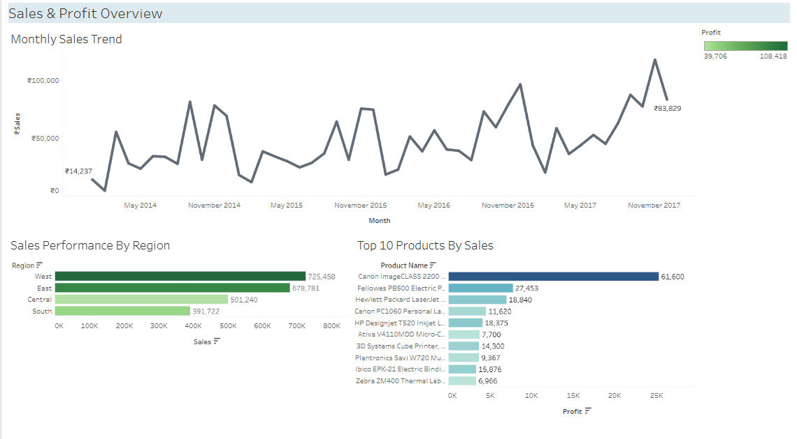

# 📊 Sales Data Analytics Project

### 🧠 Overview

This project focuses on analyzing **sales performance data** using **SQL, Python, and Tableau** to uncover meaningful business insights.  
The goal was to transform raw transactional data into actionable insights about **sales trends, regional performance, and top-performing products**.

Through this project, I practiced **data cleaning, database creation, exploratory data analysis (EDA)**, and **data visualization** — simulating the workflow of a real-world data analyst.

---

## 📂 Project Structure

SALES_PROFIT_ANALYSIS/
├── data/
│ ├── SalesNCustomerData.csv # Original dataset
│ ├── CleanedSalesData.csv # Cleaned dataset after preprocessing
│
├── database/
│ ├── SalesData.db # SQLite database for SQL queries
│
├── notebooks/
│ ├── dataCleaning.ipynb # Data cleaning and preprocessing in Python
│ ├── profitablefactsAnalysis.ipynb # Profitability and insights analysis
│ ├── timeSeriesAnalysis.ipynb # Monthly and yearly trend analysis
│
├── SQLqueries/
│ ├── RegionalSales.sql # Sales performance by region
│ ├── TopProducts.sql # Top 10 products by profit
│ ├── MonthlyTrends.sql # Monthly sales trend query
│
├── create_db.py # Script to create SQLite database
└── README.md # Project documentation

---

## 🧹 Step 1: Data Cleaning & Preparation

- Loaded the raw dataset using **Pandas**
- Handled missing values, corrected data types, and standardized column names
- Removed duplicates and irrelevant records
- Saved the cleaned data as `CleanedSalesData.csv`

**Tools:** `Python`, `Pandas`, `NumPy`

---

## 🗃️ Step 2: Database Creation & SQL Analysis

- Created a **SQLite database** `SalesData.db` using the cleaned dataset
- Wrote multiple SQL queries to extract insights:

| Query                 | Description                          |
| --------------------- | ------------------------------------ |
| **RegionalSales.sql** | Analyzed total sales by region       |
| **TopProducts.sql**   | Identified top 10 products by profit |
| **MonthlyTrends.sql** | Examined monthly sales growth trends |

**Tools:** `SQLite`, _SQLite Extension by Alex Covizzi (VS Code)_

---

## 📈 Step 3: Exploratory Data Analysis (Python)

Performed deeper EDA using **Pandas**, **Matplotlib**, and **Seaborn**:

- Profit margin distribution across categories
- Time-series trend for sales and profit
- Correlation analysis between discount, sales, and profit

---

## 🎨 Step 4: Data Visualization (Tableau)

The final dashboard was created in **Tableau Public**, summarizing the key insights from both SQL and Python analysis.

### 🖼️ Dashboard Preview

_(Insert your Tableau screenshot below)_

📸  

---

### 🔍 Dashboard Insights

1. **Monthly Sales Trend:**

   - Consistent upward growth with seasonal spikes
   - Highest sales recorded in late 2017

2. **Sales Performance by Region:**

   - Western region achieved the highest sales and profit
   - Southern region shows comparatively lower volume

3. **Top 10 Products by Sales:**
   - Canon and Fellowes products are top performers
   - Profit margins vary across categories

---

## 🧰 Tech Stack & Tools

| Category          | Tools Used                         |
| ----------------- | ---------------------------------- |
| **Languages**     | Python, SQL                        |
| **Libraries**     | Pandas, NumPy, Matplotlib, Seaborn |
| **Database**      | SQLite                             |
| **Visualization** | Tableau Public                     |
| **IDE / Editor**  | VS Code, Jupyter Notebook          |

---

## 📊 Key Learnings

- Built an end-to-end workflow: **Raw CSV → Cleaned Data → SQL DB → Visualization**
- Learned to write efficient SQL queries for analytics
- Conducted intermediate-level EDA with Python visualizations
- Designed an interactive, insight-driven dashboard in Tableau

---

## 🚀 Next Steps

- Add **KPI summary cards** (Total Sales, Profit, Avg Order Value) to the dashboard
- Include **interactive filters** for Region and Year
- Build a **Power BI version** for comparison

---

## 🧾 Author

**Megha Roy**  
Aspiring Data Analyst | Python • SQL • Tableau | Data Science Enthusiast

📧 [Email Me](mailto:roymegha952@gmail.com)  
🌐 [LinkedIn](https://www.linkedin.com/in/megha1999r/)
